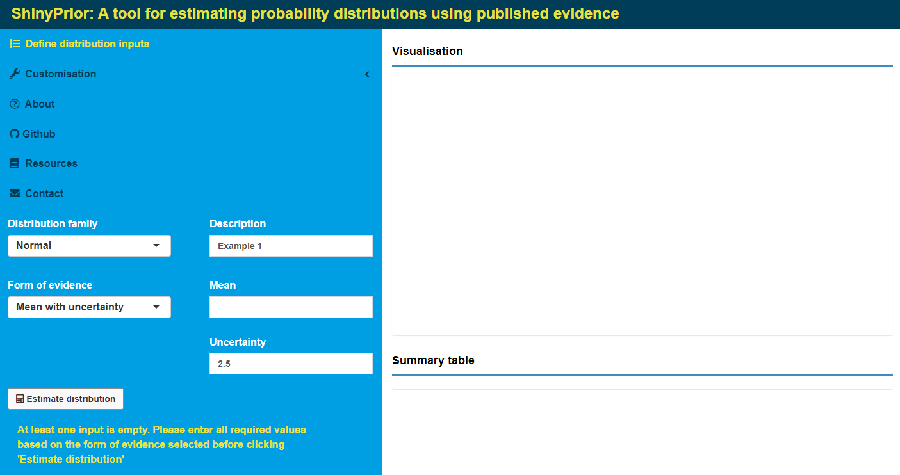
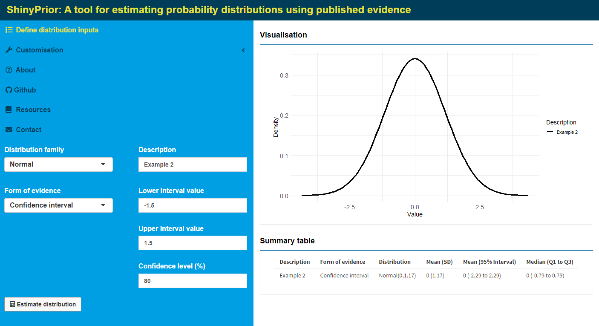

<style type="text/css">
body{
font-size: 12pt;
font-family: "Arial";
.basic-styling td,
.basic-styling th {
border: 1px solid #999;
padding: 0.5rem;

}
</style>


```{r setup, include=FALSE}
knitr::opts_chunk$set(echo = FALSE)
library(tidyverse)
library(kableExtra)
library(RColorBrewer)
library(flextable)
```

# **Overview**


***ShinyPrior*** is a web-based application for estimating probability distributions from summary statistics. The application was originally designed to help researchers characterise uncertainty in model inputs, as part of health economic evaluation [@drummond2015methods]. The application was developed using the <tt>shiny</tt> [@shinypkg] and <tt>shinydashboard</tt> [@shinydashboardpkg] packages available in R [@Rcite].

The purpose of this vignette is to outline the main steps involved in using ***ShinyPrior***. The process is described by two main steps, which have been divided into separate menus displayed on the left-hand side of the application:


**1. Define distribution inputs**: The user specifies the type of distribution and form of evidence available to estimate distribution parameters

**2. Customisation**: Provides options to summarise one or more estimated distributions, to produce publication ready figures and tables.

Troubleshooting tips are given in Section 3.

&nbsp;   

## **1. Define distribution inputs**


#### **Distribution family**

Available distributions are defined by two unknown parameters, and were selected based on their common use in health economic evaluations to characterise uncertainty in continuous model inputs. Table 1 provides further details about each distribution family. Assumed parmeterisations align with the R help documentation. Users wishing to use application outputs in other software are advised to check software-specific parameterisations to ensure consistency across platforms. A conversion table from R to STATA and TreeAge is provided under the **Resources** menu.

&nbsp;   

```{r}
common_opts <- c("Mean with uncertainty","Confidence interval","Median with interquartile range")
tab1<-tibble(
  Distribution = c(rep("Normal",3),
                   rep("Gamma",3),rep("log-Normal",3),rep("Weibull",3),rep("Beta",4),rep("Uniform",4)),
  Parameterisation = c(rep(paste0("N(\u3bc,\u3c3)\nMean: -\u221e < \u3bc < \u221e\nStandard deviation, \u3c3 > 0"),3),
                       rep(paste0("G(\u3b1,\u3b2)\nShape: \u3b1 > 0\nScale: \u3b2 > 0"),3),
                       rep(paste0("LN(\u3bc,\u3c3)\nMean: \u3bc > 0\nStandard deviation, \u3c3 > 0"),3),
                       rep(paste0("Weib(\u3bb,\u006b)\nShape: \u3bb > 0\nScale: \u006b > 0"),3),
                       rep(paste0("Beta(\u3b1,\u3b2)\n\nShape: \u3b1 > 0\nScale: \u3b2 > 0"),4),
                       rep(paste0("U(\u0061,\u0062)\nMinimum: \u0061\nMaximum: \u0062\n-\u221e < \u0061 < \u0062 < \u221e"),4)),
  `Form(s) of evidence supported` = c(common_opts,
                                      common_opts,
                                      common_opts,
                                      common_opts,
                                      c(common_opts,"Number of events, sample size"),
                                      c(common_opts,"Minumum, Maximum")),
  `Estimation method` = c("Closed-form","Closed-form","toadd",
                          "Closed-form","Numerical optimisation","toadd",
                          "Closed-form","Closed-form","toadd",
                          "Numerical optimisation","Closed-form","toadd",
                          "Closed-form","Closed-form","toadd","Closed-form",
                          rep("Closed-form",4)))
show_tab1 = flextable(tab1) %>% 
  merge_v(j=c("Distribution","Parameterisation")) %>% theme_box %>% width(width=c(1.25,2.5,3,3)) %>% set_caption("Table 1: Available distributions and forms of evidence")
htmltools_value(show_tab1)
```
&nbsp;   

#### **Description**

ShinyPrior was designed to summarise multiple distributions within the same session. This functionality allows users to compare different distributions, as well as create figures and tables for use in research outputs. Figure and table options are discussed further in Section 2. To support this functionality, users are required to supply a text label in the _Description_ box for each unique distribution. Supplied descriptions are not subject to a character limit, however we recommend a short label of up to 20 characters. Entered labels are used to index all application outputs, and are displayed in both the Visualisation and Summary table panes. An error message will appear if a user selects _Estimate distribution_ before supplying a description. If a new distribution is specified under an existing description, the previous result matching that description will be overwritten.

#### **Form of evidence**

Distribution parameters are estimated using the form of evidence selected by the user. Forms of evidence currently available reflect commonly used summary statistics for describing unbounded and bounded continuous variables. All distributions include the options "Mean with uncertainty", "Confidence interval" and "Median with interquartile range". Available options will update based on the distribution selected from the _Distribution family_ menu. Further guidance on each option is provided below:

* Mean with uncertainty: Uncertainty is defined on the standard deviation scale and must be greater than 0. Users should therefore ensure that any appropriate transformations are applied to summary statistics before using this option.

* Confidence interval: Lower and upper interval values correspond to the lower and upper limits of the confidence interval. The confidence level must be provided as a percentage between 0 and 100%. The confidence level is used to determine the distribution percentiles corresponding to the lower and upper interval values. For example, a 95% confidence level assumes that the lower and upper interval values represent the $2.5^{th}$ and $97.5^{th}$ percentiles, respectively.

* Median with interquartile range: All three values must entered, and be within the defined range of the distribution. 

* Number of events, sample size: For the Beta distribution only. The number of events must be greater than 0 and less than the defined sample size.

* Minimum and Maximum: For the Uniform distribution only. 

Required inputs are dynamically updated based on the option selected from the _Form of evidence_ drop-down menu. An error message will appear if incompatible values are entered or if one or more inputs are missing. Errors messages include guidance on feasible values, as appropriate. An example error message is shown in Figure 1.

&nbsp;   
Figure 1: Example error message generated after supplying incorrect inputs. In this case, the Mean value is missing
 



&nbsp;   


#### **Estimate distribution**

Supplied inputs are used to estimate distribution parameters based on closed-form solutions, when available, or by numerical optimisation. Numerical optimisation methods are pre-specified based on the number of parameters without a closed form solution. Numerical optimisation of a single unknown parameter is conducted using one-dimensional root finding, conditional on the closed-form estimate of the other parameter. In the case of two unknown parameters, a quasi-Newton routine is implemented using the general optimisation function <tt>optim()</tt>, imported from the <tt>stats</tt> package. Optimisation aims to minimise the sum of squares between expected and observed values.

Once estimated, results for the current distribution are displayed in the Visualisation and Summary table windows (Figure 2). Previous results can be added via the **Customisation** menu.

&nbsp; 

Figure 2: Example application display for a single distribution. Outputs are generated after specfying all inputs under "Define distribution inputs" and pressing the button "Estimate distribution"
   




&nbsp;   


## **2. Customisation**

ShinyPrior gives several options for customising the appearance of density plots and summary table information. Results can be customised for a single distribution result, or collectively for multiple results. For all outputs, the distribution(s) of interest are specified in the _Select distribution(s)_ box. Please note that both Visualisation and Summary table windows will update based on names specified in the _Select distribution(s)_ box.

Outputs can be exported at any time into selected file formats for future use. All results are saved by the application for use in figures and tables until they are deleted by the user (see **Remove results from saved output**).

### **Visualisation**

Density plots are generated using the <tt>ggplot2</tt> package. Options to customise plot output include colour palette (_Choose colour scheme_), plot theme (_Select plot theme_), axis/legend labels (_x-axis label_, _y-axis label_, _Legend title_) and legend display (_Display legend_). See Table 2 for a description of plot elements.

&nbsp;   

```{r,results='asis'}
tab2 <- tibble(
  `Plot element` = c("Colour scheme","Plot theme","x-axis label","y-axis label","Display legend","Legend title","Format","Resolution","Height (cm)","Width (cm)","Figure name"),
  `Format` = c("Drop-down selection","Drop-down selection","Free-text","Free-text","Radio button","Free text","Drop-down selection","Drop-down selection","Numeric","Numeric","Free text"),
  `Options` = c(paste(c("Greyscale (default)","Accent","Dark2","Paired","Set1","Set2","Set3","Colourblind-1","Colourblind-2"),collapse=", "),
    paste(c("Minmal (default)","Light","Black/White","Classic","Gray"),collapse=", "),            
    "--","--",
    paste(c("Yes (default)","No"),collapse=', '),"--",
    paste(c(".png (default)",".tiff",".jpeg"),collapse=', '),
    paste(c("300dpi (default)","600dpi"),collapse=', '),"--","--","--"))


show_tab2 = flextable(tab2) %>% theme_box %>% width(width=c(1.25,2,7)) %>% set_caption("Table 2: Visualisation options")
htmltools_value(show_tab2)

```

&nbsp;   

Nine pre-defined colour palettes are available for use (@rcolorbrewerpkg, @rcookbook). All colour palettes include a maximum of eight colours each. The greyscale scheme includes a maximum of five colours. Hexidecimal values by colour palette are given in Table 3. 

&nbsp;   

```{r}

tab3 <- tibble(`Colour scheme`=c("Greyscale","Accent","Dark2","Paired","Set1","Set2","Set3","Colourblind-1","Colourblind-2"),
               `Max. colours`=c(5,rep(8,8)),
               `Hexidecimal values` = c(paste("#000000","#737373","#BDBDBD","#D9D9D9","#F0F0F0",sep=', '),
                                        paste("#7FC97F","#BEAED4","#FDC086","#FFFF99","#386CB0","#F0027F","#BF5B17","#666666",sep=', '),
                                        paste(brewer.pal(n=8,name="Dark2"),collapse = ', '),
                                        paste(brewer.pal(n=8,name="Paired"),collapse = ', '),
                                        paste(brewer.pal(n=8,name="Set1"),collapse = ', '),
                                        paste(brewer.pal(n=8,name="Set2"),collapse = ', '),
                                        paste(brewer.pal(n=8,name="Set3"),collapse = ', '),
                                        paste("#000000", "#E69F00", "#56B4E9", "#009E73", "#F0E442", "#0072B2", "#D55E00", "#CC79A7",sep=', '),
                                        paste("#999999", "#E69F00", "#56B4E9", "#009E73", "#F0E442", "#0072B2", "#D55E00", "#CC79A7",sep=', ')))


show_tab3 = flextable(tab3) %>% theme_box %>% width(width=c(1.25,1,7)) %>% set_caption("Table 3: Colour scheme properties")
out = htmltools_value(show_tab3)

out
```

&nbsp;   

When multiple distributions are displayed, legend colours and label ordering will match the order of results as entered in the _Select distributions(s)_ box.

The following ggplot2 themes are supported: <tt>theme_minimal()</tt> (default), <tt>theme_light()</tt>, <tt>theme_bw()</tt>, <tt>theme_classic()</tt>, and <tt>theme_gray()</tt>

Axis labels and legend title can be updated in the corresponding free-text boxes. Users may also decide to include or exclude the figure legend, by selecting the appropriate option under _Display legend?_. If "Yes" is selected, the legend will appear on the right-hand side of the figure.

Users can further specify the saved figure size (_Height (cm)_, _Width (cm)_), figure resolution (_Resolution_), and file format (_Format_). Plots can be saved at 300 or 600 dots per inch (dpi), as a .png, .tiff or .jpeg file. Custom filenames are allowed and can be specified in the _Figure name_ box.


### **Summary table**

Distribution summary statistics are presented in tabular form, generated using the <tt>flextable</tt> package [@flextablepkg]. Customisation options include the inclusion/exclusion of columns, and row ordering by _Description_ or _Distribution family_.

All table columns will appear in the Summary table window by default. Available columns are: Description, Form of evidence, Distribution, Mean (SD), Mean (95% Interval), and Median (Q1 to Q3). The Description column cannot be removed within the application. Otherwise, any number of columns may be included or excluded from the final table via the checkboxes under the **Summary table** sub-menu. Similar to figures, a custom filename may be entered in the _Table name_ box. In the current version of ShinyPrior, tables can only be exported as Word documents (.docx).

### **Remove results from saved output**

users can permanently delete estimated distributions at any time. Results to be deleted are specified in the _Select distribution(s)_ box, found in the **Remove results from saved output** sub-menu. Once entered, confirm the selection by clicking _Remove selected distribution(s)_.

&nbsp;   

## **Citation information**

If you use ShinyPrior in your work, please cite:

TODO - OSF doi

&nbsp;   

## **Acknowledgements**

ShinyPrior was developed to support other researchers create reproducible outputs for use in publications. We thank colleagues at the [Australian Centre for Health Services Innovation (AusHSI)](https://www.aushsi.org.au/) for their time spent testing and providing valuable feedback on the application. We particularly wish to thank [Hannah Carter](https://www.aushsi.org.au/about-us/team/hannah-carter/) and [Adrian Barnett](https://www.aushsi.org.au/about-us/team/adrian-barnett/) for their contributions that improved earlier versions of the application.

&nbsp;   

## **References**


